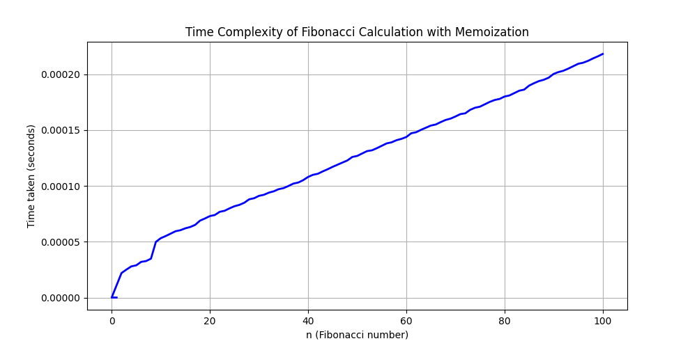

# Assignment 1 - Liao Zhu

## Prereqs

Make sure you have `matplotlib` installed and are using a Python version suitable with functools.

## Part 1
Can be found in `echo.py`. As per instructions, the script prints the 3 last characters of a given input `repetitions` amount of times, cutting off a character each time and finally printing a "." once it's done.

```bash
python3 echo.py
Yell something at a mountain: echo 123
```
Outputs 
```
123
23
3
.
```

## Part 2
Calculates Finbonacci sequence using recursion. With `n = 100`:

