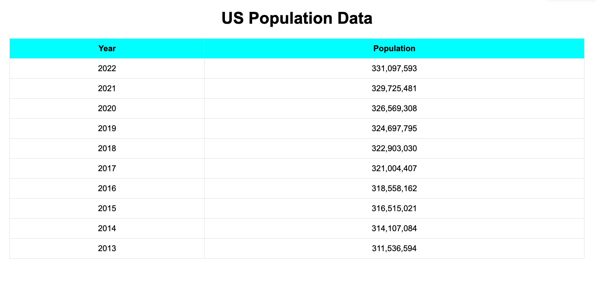

# Assignment 2 - API, JSON, HTML, JS

The html file `index.html` contains 3 sections:
1. css styling
2. html tags
3. js code

For styling I went with something simple, and to be honest I'm not that good at styling so I asked chatgpt to generate some styling there for me as a starter. From there I added some other things like coloring the table header, and adding a hover effect to each row.

The `fetchData()` arrow function in the javascript code makes an api request to `https://datausa.io/api/data?drilldowns=Nation&measures=Population` and fills in the table with the fetched data, catching any errors that may occur when fetching.

For user accessibility, I added a loading state that displays while the fetching is going on.

## Picture of assignment
