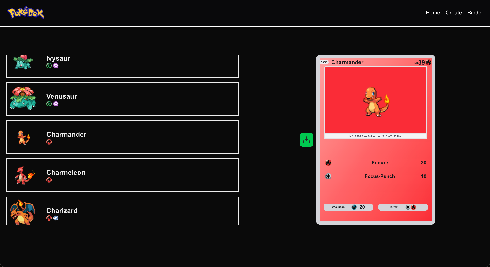

# Pokedex - Liao Zhu

This is a simulated Pokedex from the famous game "Pokemon".

## Tech Stack

Frontend: NextJS w/ React.js using Typescript + TailwindCSS

Backend: FastAPI

## Running
In your terminal:
```
git clone https://github.com/liaozhuzhu/CS3980/tree/main/midterm1
cd miterm1
```
Run the client:
```
cd client
npm install
npm run dev
```
In a seperate terminal window run the backend:
```
cd server
source virt/bin/activate
pip3 install -r requirements.txt
uvicorn main:app --reload
```

## Images
Home Page:


Binder:


Create:
