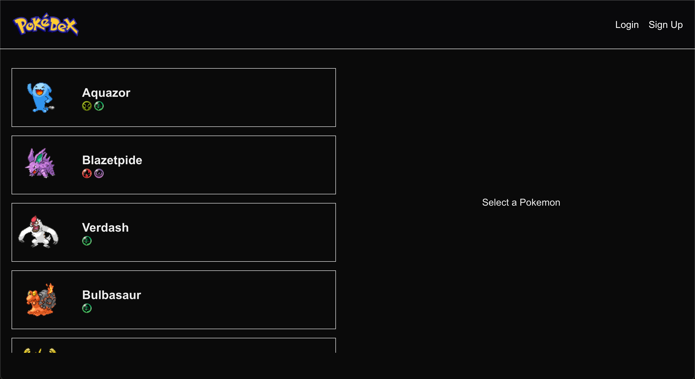
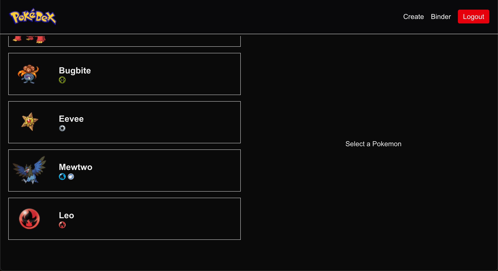
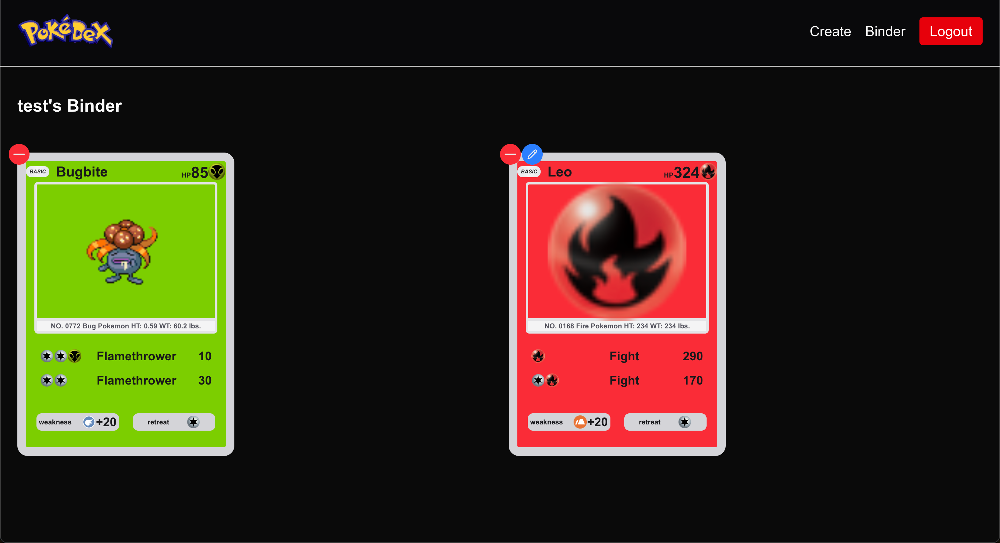
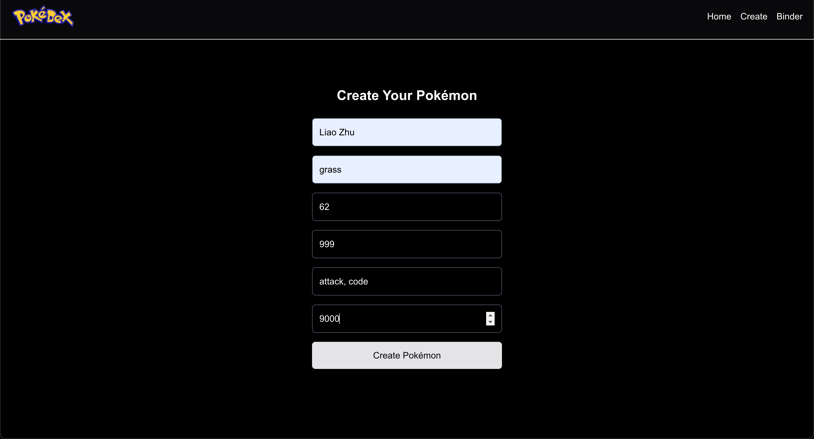

# Pokedex - Liao Zhu

This is a simulated Pokedex from the famous game "Pokemon".

Uses the PokeAPI to retrieve 50 static pokemon, but also allows the user to create their own pokemon and also add / remove pokemon from their personal binder.

## Tech Stack

Frontend: NextJS w/ React.js using Typescript + TailwindCSS

Backend: FastAPI

## Running
In your terminal:
```
git clone https://github.com/liaozhuzhu/CS3980/tree/main/midterm1
cd miterm1
```
Run the client:
```
cd client
npm install
npm run dev
```
In a seperate terminal window run the backend:
```
cd server
source virt/bin/activate
pip3 install -r requirements.txt
uvicorn main:app --reload
```

## Images (Assignment 4)
Home Page (Not Logged In):


Home Page (Logged In):


Binder (only available if loggedin):


Create:


## Models

Models can be found in [main.py](./server/main.py)

## Authentication

Authentication is also handled in [main.py](/server/main.py) and includes SHA256 hashing algorithm for password encryption. The user can only see the main page (with public pokemon) if they're not signed in, otherwise if signed in they are able to see their binder and any pokemon they've created.